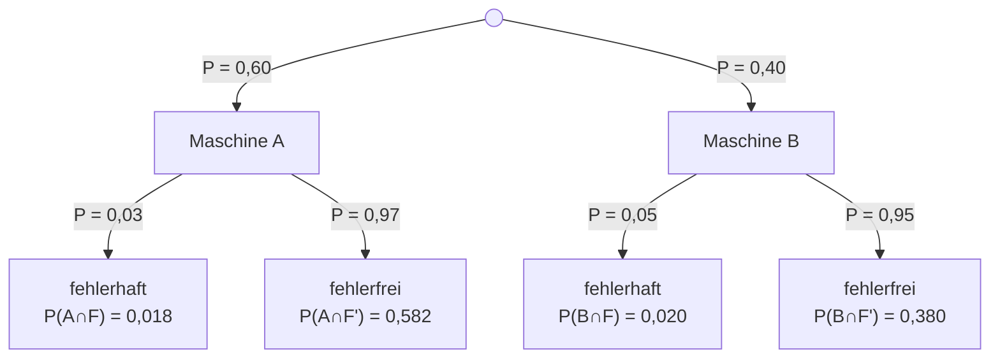

# 🤖 AGENT_INSTRUCTIONS.md – Anweisungen für KI-Agenten

Dieses Dokument enthält verbindliche Anweisungen für KI-Agenten (z. B. GitHub Copilot), die in diesem Repository Übungsklausuren erstellen oder erweitern.

---

## 🎯 Ziel

Erstelle fachlich korrekte, realistische Übungsklausuren zur Abiturvorbereitung – abgestimmt auf das Fach, das Bundesland und die Klassenstufe, die im Prompt angegeben werden. Qualität und mathematische Korrektheit haben absoluten Vorrang vor Quantität.

---

## 📁 Ordnerstruktur

Klausuren werden immer nach diesem Schema abgelegt:

```
klausuren/{fach}/{bundesland}-{klassenstufe}/{nr}/klausur.md
klausuren/{fach}/{bundesland}-{klassenstufe}/{nr}/loesung.md
```

`{nr}` ist eine **zweistellige, fortlaufende Nummer** (`01`, `02`, `03`, …), sodass es pro Fach, Bundesland und Klassenstufe mehrere Klausuren geben kann.

Beispiele:
- `klausuren/stochastik/bayern-12-klasse/01/`
- `klausuren/stochastik/bayern-12-klasse/02/`
- `klausuren/analysis/nrw-13-klasse/01/`
- `klausuren/geometrie/berlin-11-klasse/01/`

Beim Anlegen einer neuen Klausur: Prüfe, welche Nummern bereits existieren, und verwende die nächste freie Nummer.

---

## ✅ Pflichtregeln

### 1. Format

- Aufgaben und Lösung **immer** als separate Markdown-Dateien: `klausur.md` und `loesung.md`
- Jede Datei beginnt mit einem aussagekräftigen Titel (z. B. `# Stochastik-Klausur – Bayern 12. Klasse`)
- Metadaten am Anfang: Bearbeitungszeit, Hilfsmittel, Gesamtpunktzahl

### 2. Mathematische Korrektheit – KRITISCH

> **Dies ist die wichtigste Anforderung. Überprüfe JEDEN Rechenschritt mehrfach.**

- Alle Berechnungen müssen **Schritt für Schritt** nachvollziehbar sein
- **Wahrscheinlichkeiten** müssen immer zwischen 0 und 1 liegen
- **Baumdiagramme**: Alle Äste eines Knotens müssen sich zu 1 ergänzen
- **Binomialkoeffizienten** $\binom{n}{k}$ müssen korrekt berechnet sein
- **Erwartungswert** und **Standardabweichung** müssen korrekt berechnet sein:
  - $E(X) = n \cdot p$
  - $\sigma(X) = \sqrt{n \cdot p \cdot (1-p)}$
- **Hypothesentests** müssen logisch konsistent sein:
  - Null- und Alternativhypothese klar formulieren
  - Ablehnungsbereich korrekt aus der Verteilung ableiten (nicht aus der Normalapproximation schätzen)
  - Tatsächliches Signifikanzniveau angeben
  - Fehler 1. und 2. Art korrekt definieren und berechnen
- Vor der Erstellung: Alle Berechnungen mit Python/Code-Ausführung verifizieren

### 3. Bewertungsschema

- Jede Teilaufgabe erhält eine Angabe in **BE (Bewertungseinheiten)**
- Beispielformat: `[2 BE]` am Ende der Teilaufgabe
- Gesamtpunktzahl am Anfang des Dokuments angeben
- Typische Gesamtpunktzahlen: 50 BE (90 min), 75 BE (135 min), 100 BE (180 min)

### 4. Schwierigkeitsgrad

- Orientiere dich am **offiziellen Lehrplan** des angegebenen Bundeslandes
- Für Bayern gilt: Orientierung an den [Abituraufgaben des ISB](https://www.isb.bayern.de)
- Aufgaben sollen dem **Leistungsstand der Jahrgangsstufe** entsprechen
- Mischung aus Reproduktion, Anwendung und Transfer

### 5. Sprache

- Aufgaben für **deutsche Bundesländer** werden auf **Deutsch** verfasst
- Für andere Länder die jeweilige Amtssprache verwenden
- Fachbegriffe im Stil des jeweiligen Schulsystems verwenden

---

## 📐 Mathematische Formeln

Verwende LaTeX-Syntax direkt im Markdown:

- **Inline-Formeln**: `$...$` – z. B. `$P(A|B) = \frac{P(A \cap B)}{P(B)}$`
- **Block-Formeln**: `$$...$$` – für mehrzeilige oder hervorgehobene Formeln

Beispiele:
```markdown
Die Binomialwahrscheinlichkeit berechnet sich als:

$$P(X = k) = \binom{n}{k} \cdot p^k \cdot (1-p)^{n-k}$$

Der Erwartungswert ist $E(X) = n \cdot p$ und die Standardabweichung $\sigma(X) = \sqrt{n \cdot p \cdot (1-p)}$.
```

---

## 🌳 Diagramme mit Mermaid

Baumdiagramme und andere Diagramme werden **direkt in Markdown** mit Mermaid eingebettet:

````markdown

````

Regeln für Mermaid-Baumdiagramme:
- Wahrscheinlichkeiten als Kantenbeschriftungen (`|P = ...|`)
- Endknoten enthalten Pfadwahrscheinlichkeiten
- Kontrolliere: Alle Äste eines Knotens ergeben zusammen 1,00

---

## 🌐 Interaktive HTML-Visualisierungen

Falls eine Visualisierung das Verständnis einer Lösung erheblich verbessert (z. B. Histogramme der Binomialverteilung, Normalverteilungskurven), erstelle eine **eigenständige, lokal lauffähige HTML-Datei**:

- Dateiname: z. B. `visualisierung_binomialverteilung.html`
- **Keine externen Abhängigkeiten außer CDN** (die Seite muss ohne Build-Prozess öffenbar sein)
- Empfohlene Bibliotheken via CDN:
  - **Chart.js**: `https://cdn.jsdelivr.net/npm/chart.js`
  - **MathJax**: `https://cdn.jsdelivr.net/npm/mathjax@3/es5/tex-mml-chtml.js`
  - **Plotly**: `https://cdn.plot.ly/plotly-latest.min.js`

Beispiel-Gerüst:
```html
<!DOCTYPE html>
<html lang="de">
<head>
    <meta charset="UTF-8">
    <title>Binomialverteilung B(n; p)</title>
    <script src="https://cdn.jsdelivr.net/npm/chart.js"></script>
</head>
<body>
    <canvas id="chart"></canvas>
    <script>
        // Visualisierungslogik hier
    </script>
</body>
</html>
```

---

## 📋 Struktur einer Klausur (`klausur.md`)

```markdown
# {Fach}-Klausur – {Bundesland} {Klassenstufe}

**Bearbeitungszeit:** XX Minuten  
**Hilfsmittel:** Teil A: keine | Teil B: CAS-Rechner, Formelsammlung  
**Gesamtpunktzahl:** XX BE

---

## Teil A – Ohne Hilfsmittel (XX BE)

### Aufgabe 1 – {Thema} (XX BE)

{Sachkontext und Aufgabenstellung}

a) {Teilaufgabe} [X BE]
b) {Teilaufgabe} [X BE]

---

## Teil B – Mit Hilfsmitteln (XX BE)

### Aufgabe 3 – {Thema} (XX BE)

...
```

---

## 📋 Struktur einer Lösung (`loesung.md`)

```markdown
# Musterlösung: {Fach}-Klausur – {Bundesland} {Klassenstufe}

---

## Teil A – Ohne Hilfsmittel

### Aufgabe 1 (X BE)

**a)** [X BE]

{Vollständiger Rechenweg mit LaTeX-Formeln}

$$\text{Formel}$$

**b)** [X BE]

...

---

## Bewertungsübersicht

| Aufgabe | Teilaufgabe | BE |
|---------|-------------|----|
| 1       | a)          | X  |
...
| **Gesamt** |          | **XX** |
```

---

## ⚠️ Häufige Fehler – Diese musst du vermeiden

| Fehler | Korrekt |
|--------|---------|
| Wahrscheinlichkeit > 1 | Immer $0 \leq P \leq 1$ |
| Baumäste addieren nicht zu 1 | Alle Äste eines Knotens summieren zu 1 |
| Falscher Ablehnungsbereich | Kumulierte Binomial-CDF verwenden, nicht Normalapproximation |
| Fehlende Zwischenschritte | Jeden Rechenschritt explizit aufführen |
| Falsches Signifikanzniveau | Tatsächliches α aus der Verteilung bestimmen |
| Vertauschen von Fehler 1./2. Art | Fehler 1. Art: H₀ fälschlich ablehnen; Fehler 2. Art: H₀ fälschlich beibehalten |
| $\sigma$ statt $\sigma^2$ | Standardabweichung = $\sqrt{n \cdot p \cdot (1-p)}$, Varianz = $n \cdot p \cdot (1-p)$ |

---

## 🔍 Qualitätssicherung vor dem Commit

Bevor du die Dateien commitest, überprüfe:

- [ ] Alle Wahrscheinlichkeiten liegen zwischen 0 und 1
- [ ] Alle Baumdiagramm-Äste summieren sich korrekt
- [ ] E(X) und σ(X) stimmen mit n und p überein
- [ ] Ablehnungsbereich wurde aus der korrekten Verteilung (nicht Approximation) bestimmt
- [ ] Tatsächliches Signifikanzniveau ≤ α
- [ ] Beobachtetes Ergebnis korrekt mit Ablehnungsbereich verglichen
- [ ] Alle Berechnungen wurden mit Code/Rechner verifiziert
- [ ] BE-Summen stimmen (Teilaufgaben + Gesamt)
- [ ] Musterlösung enthält vollständige Rechenwege (keine übersprungenen Schritte)
