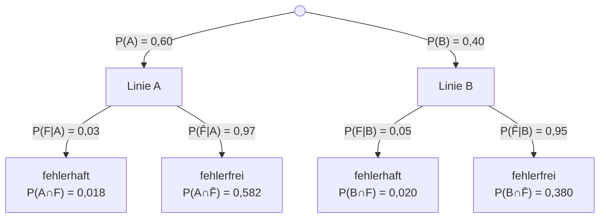

# Musterlösung: Stochastik-Klausur – Bayern 12. Klasse

> Alle Wahrscheinlichkeiten sind auf vier Dezimalstellen gerundet, Prozentwerte auf zwei Dezimalstellen.

---

## Teil A – Ohne Hilfsmittel (20 BE)

---

### Aufgabe 1 – Freizeitaktivitäten: Bedingte Wahrscheinlichkeit (8 BE)

#### a) Vierfeldertafel [2 BE]

Gegeben: $n = 30$, $|S| = 18$, $|M| = 12$, $|S \cap M| = 6$

Daraus folgt:
- $|S \cap \overline{M}| = 18 - 6 = 12$
- $|\overline{S} \cap M| = 12 - 6 = 6$
- $|\overline{S} \cap \overline{M}| = 30 - 18 - 12 + 6 = 6$

|                     | $M$ | $\overline{M}$ | $\Sigma$ |
|---------------------|-----|----------------|----------|
| $S$                 |  6  |       12       |    18    |
| $\overline{S}$      |  6  |        6       |    12    |
| $\Sigma$            | 12  |       18       |    30    |

**Probe:** $6 + 12 + 6 + 6 = 30$ ✓

#### b) Wahrscheinlichkeiten [3 BE]

$$P(S) = \frac{18}{30} = \frac{3}{5} = 0{,}6$$

$$P(M) = \frac{12}{30} = \frac{2}{5} = 0{,}4$$

$$P(S \cap M) = \frac{6}{30} = \frac{1}{5} = 0{,}2$$

**Bedingte Wahrscheinlichkeiten** (Definition: $P(A \mid B) = \frac{P(A \cap B)}{P(B)}$):

$$P(M \mid S) = \frac{P(M \cap S)}{P(S)} = \frac{6/30}{18/30} = \frac{6}{18} = \frac{1}{3} \approx 0{,}3333$$

$$P(S \mid M) = \frac{P(S \cap M)}{P(M)} = \frac{6/30}{12/30} = \frac{6}{12} = \frac{1}{2} = 0{,}5$$

#### c) Stochastische Unabhängigkeit [3 BE]

Zwei Ereignisse $S$ und $M$ sind **stochastisch unabhängig**, wenn gilt:
$$P(S \cap M) = P(S) \cdot P(M)$$

**Überprüfung:**
$$P(S) \cdot P(M) = \frac{3}{5} \cdot \frac{2}{5} = \frac{6}{25} = 0{,}24$$

$$P(S \cap M) = \frac{6}{30} = \frac{1}{5} = 0{,}20$$

Da $0{,}24 \neq 0{,}20$, gilt: $P(S \cap M) \neq P(S) \cdot P(M)$.

**Alternative Begründung:** $P(M \mid S) = \frac{1}{3} \approx 0{,}333 \neq 0{,}4 = P(M)$

➡️ **Die Ereignisse $S$ und $M$ sind nicht stochastisch unabhängig.** Wer Sport treibt, spielt seltener ein Musikinstrument als der Durchschnitt der Klasse.

---

### Aufgabe 2 – Qualitätskontrolle: Baumdiagramm und Satz von Bayes (12 BE)

#### a) Baumdiagramm [3 BE]

Ereignisse: $A$ = „Bauteil von Linie A", $B$ = „Bauteil von Linie B", $F$ = „Bauteil fehlerhaft", $\overline{F}$ = „Bauteil fehlerfrei"

**Probe Äste:**
- Linie A: $0{,}03 + 0{,}97 = 1{,}00$ ✓
- Linie B: $0{,}05 + 0{,}95 = 1{,}00$ ✓
- Wurzel: $0{,}60 + 0{,}40 = 1{,}00$ ✓

#### b) Gesamtwahrscheinlichkeit für fehlerhaftes Bauteil [3 BE]

Mit dem **Satz der totalen Wahrscheinlichkeit**:

$$P(F) = P(F \mid A) \cdot P(A) + P(F \mid B) \cdot P(B)$$

$$P(F) = 0{,}03 \cdot 0{,}60 + 0{,}05 \cdot 0{,}40$$

$$P(F) = 0{,}018 + 0{,}020 = \mathbf{0{,}038}$$

Die Wahrscheinlichkeit, ein fehlerhaftes Bauteil zufällig zu entnehmen, beträgt **3,8 %**.

#### c) Satz von Bayes: P(A | F) [4 BE]

**Gesucht:** Wahrscheinlichkeit, dass ein fehlerhaftes Bauteil von Linie A stammt.

Mit dem **Satz von Bayes**:

$$P(A \mid F) = \frac{P(F \mid A) \cdot P(A)}{P(F)}$$

**Zähler:** $P(F \mid A) \cdot P(A) = 0{,}03 \cdot 0{,}60 = 0{,}018$

**Nenner:** $P(F) = 0{,}038$ (aus Teilaufgabe b)

$$P(A \mid F) = \frac{0{,}018}{0{,}038} = \frac{18}{38} = \frac{9}{19} \approx \mathbf{0{,}4737}$$

Entsprechend: $P(B \mid F) = \frac{0{,}020}{0{,}038} = \frac{10}{19} \approx 0{,}5263$

**Probe:** $P(A \mid F) + P(B \mid F) = \frac{9}{19} + \frac{10}{19} = \frac{19}{19} = 1$ ✓

#### d) Beitrag zur Gesamtfehlerquote [2 BE]

| Produktionslinie | Anteil an Produktion | Fehlerrate | Anteil an allen Fehlern |
|-----------------|---------------------|------------|------------------------|
| Linie A         | 60 %                | 3 %        | $0{,}018 / 0{,}038 \approx 47{,}4\,\%$ |
| Linie B         | 40 %                | 5 %        | $0{,}020 / 0{,}038 \approx 52{,}6\,\%$ |

**Ergebnis:** Linie B trägt mit ca. 52,6 % etwas stärker zur Gesamtfehlerquote bei, obwohl sie weniger produziert. Dies liegt an der deutlich höheren Fehlerrate (5 % vs. 3 %).

---

## Teil B – Mit Hilfsmitteln (30 BE)

---

### Aufgabe 3 – LED-Leuchtmittel: Binomialverteilung (12 BE)

#### a) Verteilung, Erwartungswert und Standardabweichung [3 BE]

**Begründung der Binomialverteilung:**
- Es werden $n = 20$ Lampen unabhängig voneinander getestet.
- Jede Lampe hat dieselbe Wahrscheinlichkeit $p = 0{,}15$, fehlerhaft zu sein.
- Das Ergebnis jeder Prüfung ist binär: fehlerhaft oder einwandfrei.
- Es gelten die Voraussetzungen einer Bernoulli-Kette.

$$X \sim B(20;\; 0{,}15)$$

**Erwartungswert:**
$$E(X) = n \cdot p = 20 \cdot 0{,}15 = \mathbf{3}$$

Im Durchschnitt sind 3 von 20 geprüften Lampen fehlerhaft.

**Standardabweichung:**
$$\sigma(X) = \sqrt{n \cdot p \cdot (1-p)} = \sqrt{20 \cdot 0{,}15 \cdot 0{,}85} = \sqrt{2{,}55} \approx \mathbf{1{,}597}$$

#### b) P(X = 3) [3 BE]

$$P(X = 3) = \binom{20}{3} \cdot (0{,}15)^3 \cdot (0{,}85)^{17}$$

**Schritt für Schritt:**

$$\binom{20}{3} = \frac{20 \cdot 19 \cdot 18}{3 \cdot 2 \cdot 1} = \frac{6840}{6} = 1140$$

$$(0{,}15)^3 = 0{,}003375$$

$$(0{,}85)^{17} \approx 0{,}063113$$

$$P(X = 3) = 1140 \cdot 0{,}003375 \cdot 0{,}063113 \approx \mathbf{0{,}2428}$$

**Interpretation:** Mit einer Wahrscheinlichkeit von etwa **24,28 %** sind in der Stichprobe von 20 Lampen genau 3 fehlerhaft. Dies ist der wahrscheinlichste Einzelwert (er entspricht dem Erwartungswert $E(X) = 3$).

#### c) P(X ≤ 2) [3 BE]

$$P(X \leq 2) = P(X=0) + P(X=1) + P(X=2)$$

$$P(X=0) = \binom{20}{0} \cdot (0{,}15)^0 \cdot (0{,}85)^{20} = 1 \cdot 1 \cdot (0{,}85)^{20} \approx 0{,}0388$$

$$P(X=1) = \binom{20}{1} \cdot (0{,}15)^1 \cdot (0{,}85)^{19} = 20 \cdot 0{,}15 \cdot (0{,}85)^{19} \approx 0{,}1368$$

$$P(X=2) = \binom{20}{2} \cdot (0{,}15)^2 \cdot (0{,}85)^{18} = 190 \cdot 0{,}0225 \cdot (0{,}85)^{18} \approx 0{,}2293$$

$$P(X \leq 2) \approx 0{,}0388 + 0{,}1368 + 0{,}2293 = \mathbf{0{,}4049}$$

**Interpretation:** Mit einer Wahrscheinlichkeit von etwa **40,49 %** sind höchstens 2 der 20 geprüften Lampen fehlerhaft. In weniger als der Hälfte der Stichproben finden sich 0, 1 oder 2 Fehler.

#### d) P(X > 5) – Wahrscheinlichkeit der Beanstandung [3 BE]

$$P(X > 5) = 1 - P(X \leq 5)$$

Berechnung von $P(X \leq 5)$ (mit CAS):

| $k$ | $P(X = k)$ | $P(X \leq k)$ |
|-----|------------|---------------|
| 0   | 0,0388     | 0,0388        |
| 1   | 0,1368     | 0,1756        |
| 2   | 0,2293     | 0,4049        |
| 3   | 0,2428     | 0,6477        |
| 4   | 0,1821     | 0,8298        |
| 5   | 0,1028     | **0,9327**    |

$$P(X \leq 5) \approx 0{,}9327$$

$$P(X > 5) = 1 - 0{,}9327 = \mathbf{0{,}0673}$$

**Ergebnis:** Die Lieferung wird mit einer Wahrscheinlichkeit von ca. **6,73 %** beanstandet.

---

### Aufgabe 4 – Schulfest-Lotterie: Hypothesentest (18 BE)

#### a) Hypothesen und Testrichtung [2 BE]

- **Nullhypothese $H_0$:** $p = 0{,}30$ (Die Gewinnwahrscheinlichkeit beträgt wie behauptet 30 %.)
- **Alternativhypothese $H_1$:** $p < 0{,}30$ (Die Gewinnwahrscheinlichkeit ist kleiner als 30 %.)

**Begründung der Testrichtung:** Die Schülerin vermutet, dass die tatsächliche Gewinnwahrscheinlichkeit *niedriger* als die behaupteten 30 % ist. Daher handelt es sich um einen **linksseitigen Test** – $H_0$ wird abgelehnt, wenn zu wenige Gewinne beobachtet werden.

#### b) Ablehnungsbereich [6 BE]

Unter $H_0$ gilt: $X \sim B(25;\; 0{,}30)$.

Beim **linksseitigen Test** suchen wir den größten Wert $k^*$, sodass:
$$P(X \leq k^* \mid H_0) \leq \alpha = 0{,}05$$

**Systematische Bestimmung** (kumulierte Wahrscheinlichkeiten für $X \sim B(25; 0{,}30)$):

| $k$ | $P(X = k)$ | $P(X \leq k)$ | $\leq 0{,}05$? |
|-----|------------|---------------|----------------|
| 0   | 0,0001     | 0,0001        | ✓              |
| 1   | 0,0014     | 0,0016        | ✓              |
| 2   | 0,0074     | 0,0090        | ✓              |
| 3   | 0,0243     | **0,0332**    | ✓              |
| 4   | 0,0572     | 0,0905        | ✗              |

- $P(X \leq 3) \approx 0{,}0332 \leq 0{,}05$ ✓
- $P(X \leq 4) \approx 0{,}0905 > 0{,}05$ ✗

**Ablehnungsbereich:**
$$K = \{x \in \mathbb{N}_0 \mid x \leq 3\} = \{0, 1, 2, 3\}$$

**Tatsächliches Signifikanzniveau:**
$$\alpha^* = P(X \leq 3 \mid H_0) \approx \mathbf{0{,}0332} = 3{,}32\,\%$$

Das tatsächliche Signifikanzniveau beträgt 3,32 % und liegt damit unter dem vorgegebenen Niveau von 5 %.

#### c) Testergebnis und Schlussfolgerung [3 BE]

**Beobachtetes Ergebnis:** $x = 3$

**Überprüfung:** Liegt $x = 3$ im Ablehnungsbereich $K = \{0, 1, 2, 3\}$?

$$3 \in K \quad \Rightarrow \quad H_0 \text{ wird abgelehnt.}$$

**Schlussfolgerung:** Da $x = 3 \in K$, wird die Nullhypothese zum Signifikanzniveau $\alpha = 5\,\%$ abgelehnt. Die Stichprobe liefert statistisch signifikante Hinweise darauf, dass die tatsächliche Gewinnwahrscheinlichkeit bei der Schulfest-Lotterie kleiner als 30 % ist.

#### d) Fehler 2. Art für p = 0,20 [5 BE]

Der **Fehler 2. Art** tritt auf, wenn $H_0$ nicht abgelehnt wird, obwohl die tatsächliche Gewinnwahrscheinlichkeit $p = 0{,}20$ beträgt.

$H_0$ wird **nicht abgelehnt**, wenn $x \notin K$, also wenn $x \geq 4$.

**Fehlerwahrscheinlichkeit 2. Art:**
$$\beta = P(X \notin K \mid p = 0{,}20) = P(X \geq 4 \mid X \sim B(25;\; 0{,}20))$$

$$\beta = 1 - P(X \leq 3 \mid X \sim B(25;\; 0{,}20))$$

**Berechnung von $P(X \leq 3 \mid X \sim B(25;\; 0{,}20))$:**

$$P(X=0) = (0{,}80)^{25} \approx 0{,}0038$$

$$P(X=1) = \binom{25}{1} \cdot 0{,}20 \cdot (0{,}80)^{24} = 25 \cdot 0{,}20 \cdot (0{,}80)^{24} \approx 0{,}0236$$

$$P(X=2) = \binom{25}{2} \cdot (0{,}20)^2 \cdot (0{,}80)^{23} = 300 \cdot 0{,}04 \cdot (0{,}80)^{23} \approx 0{,}0708$$

$$P(X=3) = \binom{25}{3} \cdot (0{,}20)^3 \cdot (0{,}80)^{22} = 2300 \cdot 0{,}008 \cdot (0{,}80)^{22} \approx 0{,}1358$$

$$P(X \leq 3 \mid p = 0{,}20) \approx 0{,}0038 + 0{,}0236 + 0{,}0708 + 0{,}1358 = 0{,}2340$$

$$\beta = 1 - 0{,}2340 = \mathbf{0{,}7660}$$

**Interpretation:** Wenn die tatsächliche Gewinnwahrscheinlichkeit $p = 0{,}20$ beträgt, wird $H_0$ trotzdem mit einer Wahrscheinlichkeit von ca. **76,6 %** nicht abgelehnt. Dieser hohe Wert zeigt, dass der Test bei einer Stichprobengröße von $n = 25$ eine relativ geringe **Testschärfe** (Power = $1 - \beta \approx 23{,}4\,\%$) besitzt. Um den Fehler 2. Art zu reduzieren, müsste der Stichprobenumfang erhöht werden.

#### e) Unterschied Fehler 1. Art und Fehler 2. Art [2 BE]

| Fehlertyp | Definition | Im Kontext dieser Aufgabe |
|-----------|-----------|--------------------------|
| **Fehler 1. Art** ($\alpha$-Fehler) | $H_0$ wird abgelehnt, obwohl sie wahr ist. | Die Schülerin kommt zu dem Schluss, dass die Gewinnwahrscheinlichkeit kleiner als 30 % ist, obwohl die Organisatorin die Wahrheit gesagt hat. |
| **Fehler 2. Art** ($\beta$-Fehler) | $H_0$ wird nicht abgelehnt, obwohl sie falsch ist. | Die Schülerin findet keinen statistischen Hinweis auf eine geringere Gewinnwahrscheinlichkeit, obwohl tatsächlich weniger als 30 % der Lose gewinnen. |

Der Fehler 1. Art wird durch die Wahl des Signifikanzniveaus $\alpha$ direkt kontrolliert. Der Fehler 2. Art hängt vom tatsächlichen Parameterwert und der Stichprobengröße ab.

---

## Bewertungsübersicht

| Aufgabe | Teilaufgabe | Inhalt                                   | BE  |
|---------|-------------|------------------------------------------|-----|
| **1**   | a)          | Vierfeldertafel                          | 2   |
|         | b)          | $P(S)$, $P(M)$, $P(S\cap M)$, $P(M\mid S)$, $P(S\mid M)$ | 3 |
|         | c)          | Unabhängigkeit prüfen und begründen      | 3   |
| **2**   | a)          | Baumdiagramm                             | 3   |
|         | b)          | Gesamtwahrscheinlichkeit $P(F)$          | 3   |
|         | c)          | Satz von Bayes: $P(A\mid F)$             | 4   |
|         | d)          | Beitrag zur Fehlerquote                  | 2   |
| **3**   | a)          | Verteilung, $E(X)$, $\sigma(X)$          | 3   |
|         | b)          | $P(X=3)$ und Interpretation              | 3   |
|         | c)          | $P(X \leq 2)$ und Interpretation         | 3   |
|         | d)          | $P(X > 5)$                               | 3   |
| **4**   | a)          | $H_0$, $H_1$, Testrichtung               | 2   |
|         | b)          | Ablehnungsbereich und tatsächl. $\alpha$ | 6   |
|         | c)          | Testergebnis und Schlussfolgerung        | 3   |
|         | d)          | Fehler 2. Art für $p = 0{,}20$           | 5   |
|         | e)          | Erläuterung Fehler 1./2. Art             | 2   |
| **Gesamt** |          |                                          | **50** |
